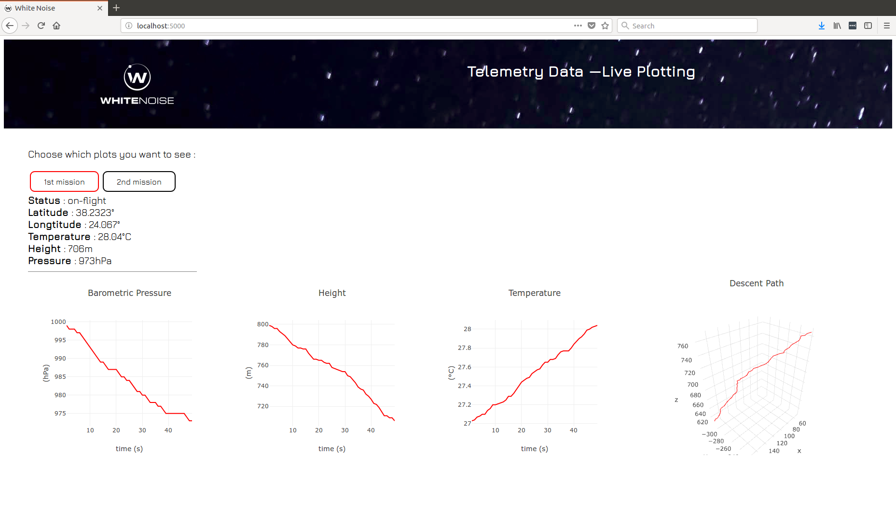

# White Noise
[White Noise](https://www.facebook.com/WhiteNoiseGRE/) is a space-engineering team from the National Technical University of Athens and currently consists of 6 members ( in alphabetical order ) :

 - Dimitris Bralios
 - Chariton Charitonidis
 - Iasonas Nikolaou
 - Spyros Pavlatos
 - George Rapakoulias
 - Miltiadis Stouras

Our team participates in the [CanSat in Greece 2018](https://cansat.gr/) competition.

# Ground Station

This repository hosts the software of our Ground Station. Specifically, we use a Python script to save telemetry data from a serial port to a JSON file and we create real-time graphs of : Barometric Pressure, Temperature, Altitude, UV Radiation and Soil Moisture with respect to time, using React.js and Plotly.js, with the data received from our satellite. We also create a real-time 3D plot of the path that the satellite has followed since separation from the rocket.
